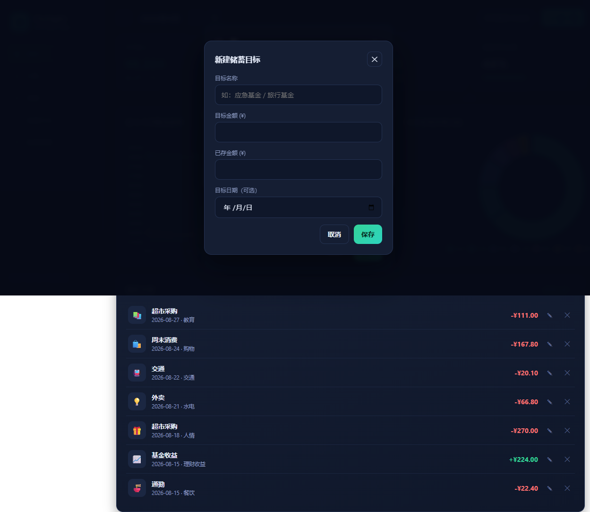

# FinSight · 个人理财仪表盘

> 记账 · 预算 · 储蓄目标可视化 —— 一个纯前端的个人财务管理工具。

**在线体验：https://first-pll.github.io/finsight/**



## 为什么做这个项目

个人财务管理是每个人都会遇到的真实问题：钱花到哪里去了？预算有没有超支？
储蓄目标进度如何？FinSight 用一个轻量、可离线运行的单页应用回答了这些问题，
把记账、预算、储蓄目标三个模块整合进同一个仪表盘，用可视化图表让消费结构一目了然。

## 功能特性

- 📊 **总览仪表盘**：本月收入 / 支出 / 结余 KPI，近 6 个月收支趋势折线图，
  本月支出分类占比环形图
- ✍️ **记账管理**：收入 / 支出双类型，10+ 预设分类，支持按类型、分类筛选，
  增删改查全支持
- 🎯 **预算控制**：按分类设置月度预算，实际花费进度条可视化，超支自动标红预警
- 🏦 **储蓄目标**：多目标并行（应急基金、旅行基金…），进度条 + 按平均月结余
  估算达成时间
- 💾 **数据自主**：数据全部保存在浏览器本地（localStorage），支持 JSON 导入导出，
  隐私零担忧
- 🚀 **零依赖部署**：Chart.js 本地内嵌，完全离线可用，可直接部署到任意静态托管

## 技术栈

- HTML5 + CSS3 + 原生 JavaScript（无框架）
- Chart.js 4.x（本地内嵌，无 CDN 依赖）
- localStorage 本地持久化

## 本地运行

直接双击打开 `index.html` 即可，无需任何构建步骤。或本地起一个静态服务器：

```bash
python -m http.server 8080
# 访问 http://localhost:8080
```

## 数据说明

所有数据仅保存在浏览器 localStorage 中，不会上传到任何服务器。
「数据管理」页提供：导出备份 (JSON)、导入恢复、载入示例数据、清空数据。

---

© 2026 Pll · MIT License
